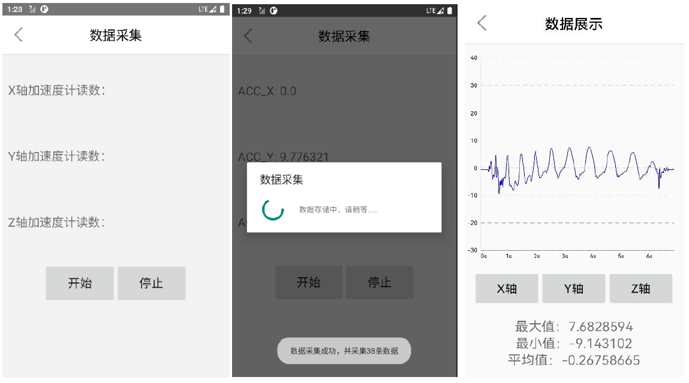
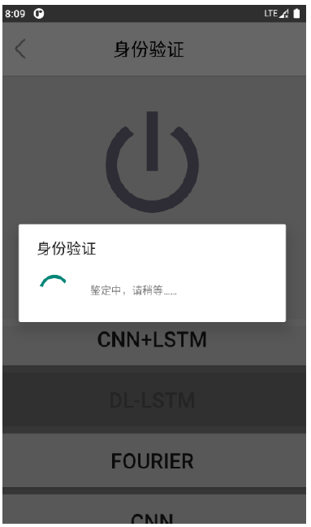
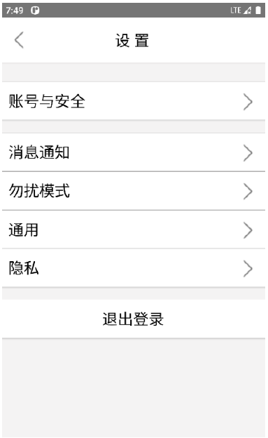
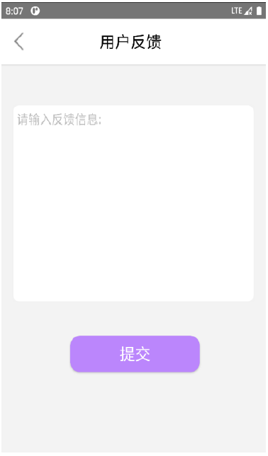

# gait-recognization

Utilize SQLite database, local storage and sensor data acquisition to realize back-end functions. The front-end interface uses multi-component and nested methods to realize a more friendly interactive interface.

- [signin](#signin)
- [collection](#collection)
- [authenication](#authenication)
- [setting](#setting)
- [brochure](#brochure)
- [feedback](#feedback)
- [about](#about)

## signin

The login module consists of two parts: login in and sign up.

## collection

Collect mobile phone accelerometer data and plot the waveform.

## authenication

Utilize different models to classify the user.

## setting

Setting the information of this APP.

## brochure

Introduction of how to use this APP.

## feedback

User can feedback some feelings.

## about

APP version information and release information.

